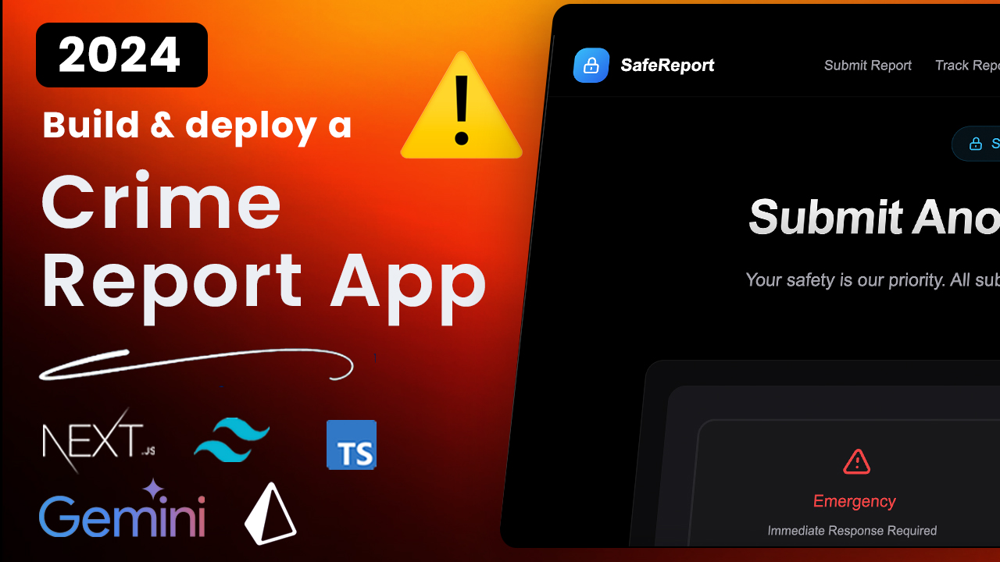

<div align="center">
  <br />
    <a href="your-demo-video-link" target="_blank">
      
    </a>
  
  <br />

  <div>
    
    
    
    
  </div>

  <h3 align="center">Anonymous Reporting App</h3>

   <div align="center">
     A secure platform for anonymous incident reporting
    </div>
</div>

## 📋 <a name="table">Table of Contents</a>

1. 🤖 [Introduction](#introduction)
2. ⚙️ [Tech Stack](#tech-stack)
3. 🔋 [Features](#features)
4. 🤸 [Quick Start](#quick-start)
5. 🕸️ [Environment Setup](#environment)
6. 🚀 [Deployment](#deployment)

## <a name="introduction">🤖 Introduction</a>

This is a state-of-the-art anonymous reporting system built with Next.js 14, designed to provide a secure platform for reporting incidents while maintaining complete anonymity.

## <a name="tech-stack">⚙️ Tech Stack</a>

- Next.js 14
- TypeScript
- Prisma with Neon Database
- NextAuth.js for Authentication
- Tailwind CSS
- React Hook Form
- GeminiAI
- BCrypt for Password Encryption


```


